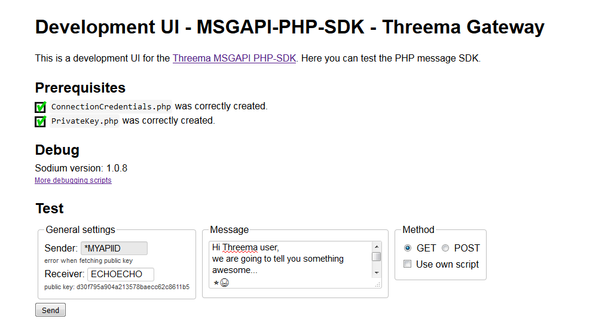

# Threema MSGAPI WebUI

This is a sample webui, which uses the [Threema Gateway PHP-SDK](https://github.com/rugk/threema-msgapi-sdk-php).

**Important:** This is only an example and it is mostly only intended as a development tool. Do not use it on productive systems unless you know what you are doing!

## Screenshot


## Requirements

You must use at least PHP 5.4 and it is strongly recommend to install libsodium. For more information, please have a look at the [installation instructions](https://github.com/rugk/threema-msgapi-sdk-php#installation) of the PHP SDK.

Additionally you need to set up a webserver and [composer](https://getcomposer.org/).

## Set up

1. Use composer to fetch and install the dependencies:

   ```Shell
   composer install
   ```

2. Go to this directory (or the `index.php`) and follow the instructions there.  
   In case you do not want to do this just look at the `.example` files and
   replace them with your own credentials.
